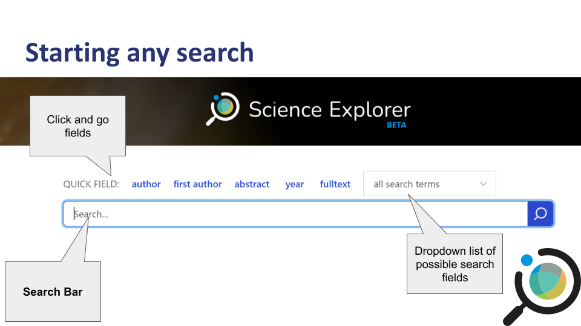
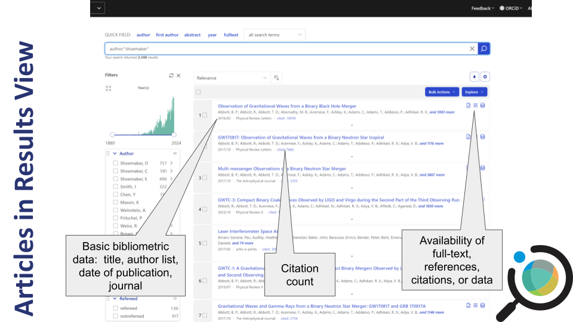
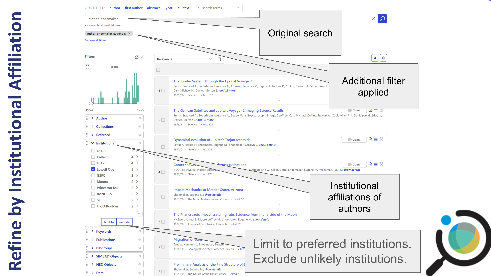

::: questions
- How do you find an article by a specific author?
- How do you find articles about a specific topic?
- What other types of resources can you discover besides articles?
:::

::: objectives
- Execute a basic author search
- Execute a basic keyword search
- Refine a search using facets
- Identify useful metadata and resources through the abstract view
- Follow links from the abstract page to access resources such as the
  open access version of the article, related software, and associated
  datasets
:::

## Basic Searches in SciX

Once you've accessed the SciX main page, you're ready to explore its search
capabilities. In this episode, we'll cover both author and keyword
searches, then show you how to refine your results.

::: instructor
You might mention the kinds of searches you commonly perform in SciX (e.g., finding articles for your domain or checking citation metrics).
The guided examples will be more meaningful if you modify them for your discpline or facility.
- Who is an author your learners would know?
- What is a topic in which your learners would be interested?
:::

## Setting Up Your Environment

When you navigate to SciX, ensure you can see the homepage.  The SciX address is [scixplorer.org](https://scixplorer.org/)

{alt='Screenshot of the SciX homepage showing the main search bar and navigation options'}

::: instructor
Ask learners: "Can everyone see the SciX homepage on their browser?"
:::

## Selecting Your Discipline

On your first visit, select your preferred discipline from the dropdown
menu in the upper left.

**Note:** This step customizes your search tools but does not limit your
overall search.

{alt='Dropdown menu for selecting a discipline in SciX, such as Planetary Science'}

## Quick Help & Navigation

SciX offers a help carousel on the main search page. Click the
left/right arrows to view introductory resources, including a quick
start guide and search examples.

{alt='Help carousel on the SciX homepage showing navigation arrows and learning resources'}

For more detailed assistance, click the "Help" button in the upper
right.

{alt='SciX homepage with the Help button highlighted in the top-right corner'}

## Starting a Search

As an open science search engine, SciX is primarily concerned with
ensuring that literature, data, and software are findable or
discoverable. So, let’s find some relevant papers. Author searches are
among the most common performed in SciX.

{alt='Highlighted search bar on the SciX homepage for entering search terms'}

:::: challenge
If you select author from either the quick fields or the dropdown menu,
SciX will add the field to the search bar.

{alt='Author field selected in the SciX search bar'}

## Author Search

1. In the search field, select **author** from the quick fields or
   dropdown.
2. Type `"shoemaker"` (for example, for Gene Shoemaker) and click the
   blue magnifying glass.


::: instructor
Learners can just type names and phrases into the search bar. However, they will have greater control over structured searches using fields like shown here than unfielded searches.
:::

::: solution
{alt='Search results initiated for author name "Shoemaker"'}
:::
::::

:::: challenge
## Search by Author

Try searching for Gene Shoemaker on your own. How many results do you
get? Discuss with your neighbor.

::: solution
{alt='Search results view showing 2,560 items for "Shoemaker"'}

author:”shoemaker” returned 2,560 results when this example was run as you can see in the upper
left; because SciX adds new material on daily and weekly cycles you may see a different count. 

The results are sorted by relevance and are in descending order.
You can change the sorting criterion by using the dropdown menu to
select: date, author count, citation count, entry date, first author,
normalized citation count, or read count. Click the button next to the
dropdown menu to switch between descending and ascending order.
:::
::::

For each article returned, you see the title, author list, date of
publication, journal, and citation count. Looking at the three icons on
the right, you can tell whether SciX links to the full-text, references
or citations, and data.

{alt='List of search results showing article titles, author names, dates, and icons for full-text, references, and datasets'}

As an open science digital library, SciX is also concerned with ensuring
you can access the papers, data, and software that you want.

{alt='Results view with callouts showing what is available when paper, references or citations, or data icons are clicked'}

Looking at the list of results as a whole, I see some interesting
articles with an author named “Shoemaker” but perhaps not immediately,
Gene Shoemaker, planetary scientist. The author box on the left allows
me to narrow my results. It lists variants of the name “Shoemaker” at
the top followed by the names of co-authors.

The most common variants and co-authors are listed first.

Clicking a name variant opens additional options:

- **Limit to** preferred name(s), showing only papers by that variant
- **Exclude** unlikely variants to remove unrelated results

This helps narrow your results to the specific individual you're interested in.

{alt='Author facet sidebar showing Shoemaker variants and frequent collaborators'}

### Refine by Institutional Affiliation

You can further narrow your search results using the **Institutions** facet.

For example, if your target author worked at Lowell Observatory, you can:

- **Limit** to papers with authors from that institution
- **Exclude** results from other affiliations

This is especially useful when multiple authors share similar names but work at different institutions.

{alt='SciX sidebar facet showing a list of institutions such as Lowell Observatory with checkboxes to include or exclude them from results'}

::: instructor
SciX also has an affiliation (aff:) field search that searches the exact affiliation text provided by the author or publisher.  The Institution facet uses a SciX standardized abbreviation and is similar to the institution (inst) field search. Some institutions listed in the facet can be opened to identify authors with individual departments. Learners asking detailed questions about this feature should be encouraged to read the SciX [blog post about it](https://scixplorer.org/scixblog/affils-update). 
:::

### Refine by Date

You can also adjust the **date range** of your results using the slider in the left sidebar.

- Drag the endpoints of the slider to limit results by year
- Click the expand icon (four arrows) to see a larger or more precise timeline

Use this if you're researching a specific publication window or want to filter out older or newer results.

{alt='Date range slider with adjustable endpoints and expand icon in SciX facet panel'}

:::: challenge
### Keyword Search

Return to the SciX main search page. Use the "all search terms" dropdown menu to start a keyword search for 'crater.' 
{alt='SciX main search terms with "all search terms" menu extended; abs search is highlighted and explained'}


::: solution
{alt='SciX results view showing 8,901 items for "Crater"'}

keyword:”crater” returned 8,901 results when this example was run as you can see in the upper
left; because SciX adds new material on daily and weekly cycles you may see a different count. 
:::
::::

### Understanding SciX Synonym Expansion

SciX automatically expands keyword searches with discipline-specific synonyms,
related terms, and even common misspellings or alternate forms. For example,
a search for `crater` might automatically include terms like:

- craters, cratering, cratered
- craterlets, craterlike, crateris
- craterform, subcrater, craterization
- krater, cratori, noncrater, etc.

This expansion improves discoverability across disciplines that might use
different terminology for the same concept.

If you only want the **exact term** you typed (no expansion), add an equals
sign: `=crater`.

This exact-match feature is helpful when you're targeting highly specific
terms or avoiding irrelevant results.

:::: challenge
## Keyword Search

Return to the SciX main search page. Execute an exact keyword search for 'crater'. 

::: solution

{alt='SciX results view of search for exact match keyword crater'}

=keyword:”crater” returned 2,329 results when this example was run as you can see in the upper
left; because SciX adds new material on daily and weekly cycles you may see a different count. 

With synonym expansaion disabled, fewer results are returned. However, those precise results may be just what you need.
:::
::::

::: challenge
## Keyword Search

Experiment with an author or keyword search, both with and without the equal sign.
What differences do you observe? Discuss your experiences with a partner
:::

::: instructor
As time allows, encourage learners to share their expectations and experiences with expanded and exact searches.
:::

### Narrowing Results Using Keyword Facet

After running a keyword search, you can refine your results using the
**Keywords** facet in the sidebar. Authors or publisheres provided these keywords, 
which are listed in order of frequency with in your results.

You can:

- Choose to **limit to preferred keywords** or **exclude undesired ones**
- Click the upward arrow in the lower right corner of the facet to browse the full list of keywords

{alt='SciX results view with Keywords facet open and arrow to access enhanced search panel highlighted'}

- Sort keywords by frequency or alphabetically
- Search for a specific keyword or partial match
- Download keywords for use outside of SciX

{alt='SciX Keywords facet search panel with results of search for keywords begining with 'sh' sorted by frequency'}

This is especially useful when you're trying to focus on a specific subtopic
or filter out irrelevant results.

::: instructor
Keyword searches are complicated because publishers use different keyword systems, which can also change over time. The keyword_schema field identifies the system where known. 
Authors who want their papers to be discovered (and cited) might want to give some additional attention to the keywords they suggest for their papers.
:::

### Powering Up Your Keyword Search

You can expand the places SciX looks for your keyword by using an abs search. Using the abs prefix will search

- title
- keywords, provided by author or publisher
- abstract

The presence of your keyword in the abstract is a better indicator of its significance within the paper as a whole than a passing mention in the full text. This "balanced" search is the most common topical search in SciX.

::: instructor
'abs' is short for "abstract' but an 'abstract' only is also possible as is a full-text search. Both of these are mentioned briefly later in the module. 
:::

:::: challenge
Return to the main menu. Use the 'all search terms' dropdown menu to start an 'abs' search for 'crater'.

::: solution
{alt='SciX results view from abs:crater search'} 

abs:”crater” returned 53,647 results when this example was run as you can see in the upper
left; because SciX adds new material on daily and weekly cycles you may see a different count. 

By searching more fields, an abs search will produce more results than just searching the keywords field alone. 
:::
::::

### Filtering by Refereed Status

SciX allows you to filter your search results based on whether a paper is
**refereed** (peer-reviewed) or **non-refereed** (everything else).

You can find this option in the **Refereed** facet in the sidebar. It's useful
if you're looking only for peer-reviewed journal articles or want to ensure you see 
other materials like conference proceedings or technical reports.

**Note:** SciX considers dissertations to be refereed. Most, but not all, conference
abstracts and proceedings are categorized as non-refereed.

- "Refereed" includes only peer-reviewed works
- "Not Refereed" includes the grey literature, preprints, or white papers

If you want only "Refereed" papers, you can either
- **Limit** to "Refereed" papers
- **Exclude** "Not Refereed" items

{alt='SciX results view including Refereed facet panel with checkboxes refereed and non-refereed papers'}

::: instructor
SciX welcomes submission of missing gray literature and disserations.  Learners can use the Missing/Incorrect option on the Feedback dropdown menu to submit articles.
SciX considers the dissertation defense a reviewing process. Not everyone would agree on this characterization.
SciX evaluates conferences individually to determine whether their abstracts and proceedings should be considered refereed or non-refereed.
:::

### Filtering by Publication Type

You can also filter your results by **Publication Type**, helping you
focus on specific formats such as:

- Journal articles
- Book chapters
- Dissertations
- Conference papers
- Technical reports
- Dataset
- Software

Use the **Publication Type** facet in the sidebar to:

- **Limit** results to your preferred document types
- **Exclude** formats that aren't relevant to your research

{alt='SciX Results View with Publication Type facet open displaying article and non-article types available'}

Within the facet, Publication Types are grouped by article (journal article, proceedings article, book chapter ....) or non-article (PhD thesis, editorial, book...)

Like the Keywords facet, clicking the upper arrow at the lower right of a long list in the Publication Type facet opens window where you can

- Sort keywords by types by frequency or alphabetically
- Search for a specific type or partial match

This is particularly helpful when your search returns a mix of source types
and you're only interested in peer-reviewed articles or long-form research. It can also help you identify specialized resources like data and software.

::: instructor
Publication Type refers to the type of document.  SciX has a separate field and facet to search and filter by journal or publisher.  By now, learners should be comfortable using the main search page 'all search terms' dropdown menu to locate the 'Publication Full Name' search or used the Publications facet. 
:::

### Searching Text 

You can target your search to specific parts of an article by using the corresponding field
search. These are especially useful when you're looking for a term in just
one section (e.g., the title) or want to exclude it from another (e.g., the body).

Common text field searches in SciX include:

- `abstract:` — abstract text only
- `title:` — title only
- `body:` — article body only
- `ack:` — acknowledgments only
- `full:` — full text of the article

in addition, to our old friends 

- `keyword:` — author- or publisher-provided keywords
- `abs:` — title, abstract, and keywords

You can also use Boolean operators (`AND`, `OR`, `NOT`) to combine or exclude terms.

For example:

```text
abs:(crater AND mars) NOT body:jezero
```

This finds articles that mention crater and Mars in the title, abstract, or keywords,
but **exclude** any that mention Jezero in the body text.

{alt='SciX results from complex search shwon in bar as 'abs:(crater AND mars) NOT body:jezero'}

::: challenge
Return to the SciX main search page. Construct a query that either includes or excludes text from the acknowledgements section.
Share your results with a neighbor.
:::

::: instructor
If time permits, encourage the learners to share their searches with the class. Ask why they might search other text fields.
:::

## Exploring the Abstract View

From any list of results, click an article title of interest to open the abstract view. When you first open the abstract view, you will see in the center


- Detailed bibliographic information (title, authors, publication
  details, DOIs)
- Abstract
- Author- or publisher-provided keywords

Along the left side, you will see 

- Links to full-text sources
- Data repositories
- Related materials, including software

SciX matches preprints to the publisher's version of record and provides a single consolidated view of these versions.

{alt='SciX main abstract page showing detailed metadata and icons for open access versions and datasets; image is annotated to highlight features'}

Clicking the links on the left side for citations, references, or similar, produces the list of corresponding papers with all of their details.  Those lists can be converted to search results for further investigation.

{alt='List of papers cited by main paper shown from within SciX abstract view with basic metadata plus annotatons highlighting features of this view'}

Clicking the links on the left side for metrics produces a graphical display of the citations to the paper over time. The citataion data can be downloaded.

{alt='Bar graph and numerical citation data for the paper shown from within SciX abstract view plus annotatons highlighting features of this view'}

Clicking the links on the left side for export citation provides access to a variety of citation formats that can be downloaded to a file or copied to the clipboard.

{alt='Export citation tools showcasing BibteX option available from within SciX abstract view plus annotatons highlighting features of this view'}

::: instructor
Most publisher formats for SciX supported disciplines are supported. If we are missing one, custom formats are possible. However, SciX encourages learners to recommend missing formats for inclusion.
Zotoro uses RIS format, which is avialable.
Mendolay uses RIS, BibteX, and EndNote, which are all available.
:::

::: challenge
### Challenge

Select an article and review its abstract view thoroughly. 
- What extra details can you find that weren't in the results view?
- What features would be most useful to you personally?
Share your findings with a neighbor.
:::

::: instructor
If time permits, enourage learners to share their experiences with the class.
:::

## Reflection and Discussion

Take a few minutes to perform a search on a topic relevant to your work
using both author and keyword searches. Then, discuss with a partner:

- What did you search for?
- Did you find relevant materials?
- What aspects of the process were straightforward or challenging?

::: challenge
## Bonus Challenge

Try exporting a citation from one of your articles. Explore the export
options and compare different formats.
:::

::: keypoints
- SciX enables effective author and keyword searches with powerful
  synonym expansion.
- Facet filters help narrow down results by author variants,
  institutional affiliation, and publication date.
- The abstract view provides in-depth details and links to additional
  resources.
:::
