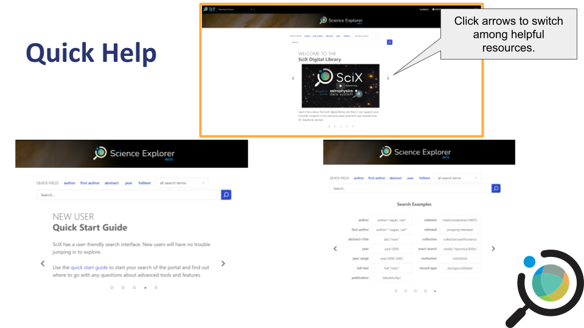

::: questions

- How do you perform an author search in SciX?
- How can you disable synonym expansion during a keyword search?
- What facets can you use to refine your search results? 

:::

::: objectives

- Execute a basic author search
- Execute a basic keyword search
- Refine a search using facets
- Identify useful metadata and resources through the abstract view
- Follow links from the abstract page to access resources such as the open access version of the article, related software, and associated datasets
- Apply consistent naming conventions to project documents

:::

## Basic Searches in SciX

Once you've logged into SciX, you're ready to explore its search capabilities. In this episode, we'll cover both author and keyword searches, then show you how to refine your results.

### Setting Up Your Environment

When you open SciX, ensure you can see the homepage.  

{alt="Screenshot of the SciX homepage"}

::: instructor 
Ask learners: "Can everyone see the SciX homepage on their browser?"  
:::

### Selecting Your Discipline

On your first visit, select your preferred discipline from the dropdown menu in the upper left.  

**Note:** This step customizes your search tools but does not limit your overall search.

{alt="Screenshot of discipline selection on SciX (e.g., Planetary Science)"}

### Quick Help & Navigation

SciX offers a help carousel on the main search page. Click the left/right arrows to view introductory resources, 
including a quick start guide and search examples. For more detailed assistance, click the "Help" button in 
the upper right.

{alt="Screenshot of SciX help carousel and Help button"}

### Starting a Search

:::: checklist

#### Author Search

1. In the search field, select **author** from the quick fields or dropdown.
2. Type `"shoemaker"` (for example, for Gene Shoemaker) and click the blue magnifying glass.

::::::

{alt="Screenshot of author search with 'shoemaker' entered"}

:::: challenge 

## Search by Author 

Try searching for Gene Shoemaker on your own. How many results do you get? Discuss with your neighbor.

::: 

:::::: checklist
#### Keyword Search

1. Type a keyword (e.g., `crater`) into the search box. Notice that SciX expands your search with synonyms automatically.
2. To search for an exact term, type `=crater` instead.

:::::

{alt="Screenshot comparing keyword search with synonym expansion vs. exact search"}

:::: challenge

## Keyword Search

Experiment with a keyword search both with and without the equal sign. What differences do you observe?
::::

### Viewing and Refining Search Results

#### Exploring the Results View

The results view shows:

- Article title, author list, publication date, and journal name
- Citation count and icons indicating available links (full text, references, citations, datasets)

{alt="Screenshot of SciX results view with bibliometric details and icons"}

:::: challenge

## Explore the Interface 

Take a moment to identify the various icons. Which icon shows you the availability of open access versions?

::::

#### Refining Your Search

Use the facets on the left side to narrow down your results:

- **Author Variants:** Use filters to focus on the correct variant (e.g., "Shoemaker, Eugene M").
- **Institutional Affiliation:** Limit results by specific institutions if desired.
- **Date Range:** Adjust the date slider to restrict the publication dates.

{alt="Screenshot of facet filters, showing author variants and date slider"}

:::: challenge

## Refine Author Search

Refine your author search by selecting a specific variant and adjust the date range. What effect do these changes have on your results?
:::: 

### Exploring the Abstract View

Click an article title to open the abstract view. Here, you can find:

- Detailed bibliographic information (title, authors, publication details)
- Links to additional resources like open access articles, software, and datasets

{alt="Screenshot of the abstract view in SciX showing additional resource links"}

::: challenge

### Challenge

Select an article and review its abstract view. What extra details can you find that weren't in the results view?
::: 

::: discussion
### Reflection and Discussion

Take a few minutes to perform a search on a topic relevant to your work using both author and keyword searches. Then, discuss with a partner:

- What did you search for?
- Did you find relevant materials?
- What aspects of the process were straightforward or challenging?
:::

:::: challenge 

### Bonus Challenge
Try exporting a citation from one of your articles. Explore the export options and compare different formats.

::::: 

::: keypoints
- SciX enables effective author and keyword searches with powerful synonym expansion.
- Facet filters help narrow down results by author variants, institutional affiliation, and publication date.
- The abstract view provides in-depth details and links to additional resources. 
:::

