::: questions
- What papers are useful to researchers working on (example topic)?
- How could I narrow (example topic) appropriately?
- What are the top collaborations in (example topic)?
:::

::: objectives
- Expand a search using SciX second-order operators, including useful and review
- Explore connections among authors and papers using SciX visualizations
:::

## Literature Exploration in SciX

In this lesson, we will be focusing on different ways to explore your search results in SciX.

### Setting Up Your Environment

When you go to [SciX](https://scixplorer.org/), ensure you can see the homepage.  

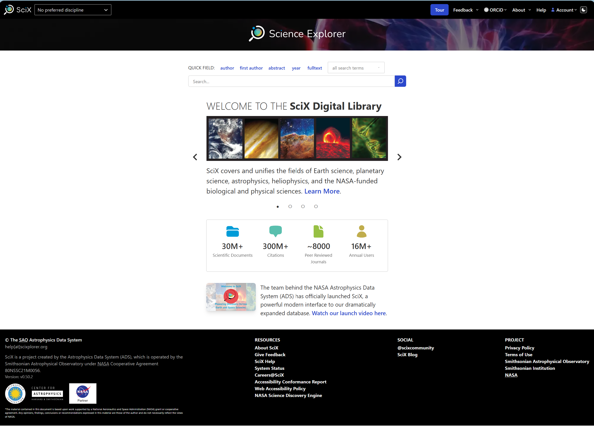{alt="Screenshot of the SciX homepage"}

::: instructor 
Ask learners: "Can everyone see the SciX homepage on their browser?"
:::

### Research Trends

First we will focus on second-order operators, which are search operations that are performed on the results of a previous query. The second order operators available in SciX are: **similar**, **useful**, **reviews**, and **trending**,. Each of these second-order operators benefit from taking different things into consideration for the initial query, so we will discuss individually the three we highlight in this lesson.

::: instructor  
You might mention the kinds of topical searches you commonly perform in SciX (e.g., finding articles for your domain or checking citation metrics). The guided examples will be more meaningful if you modify them for your discipline or facility.
:::

To get started, let's run an example search query on SciX.  You can search for any topic you are interested in, but for my demonstration, I am going to look for papers about volcanoes.


Start by entering your terms into the main search bar and executing the search.

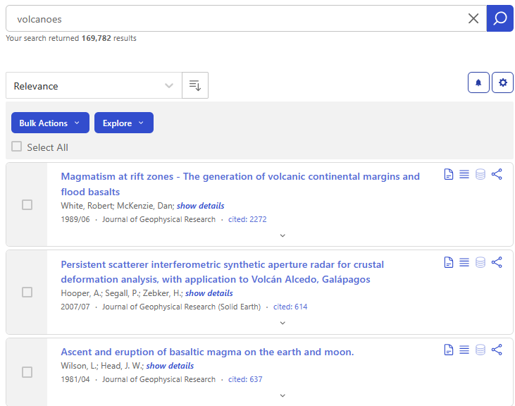{alt="Screenshot of SciX search result for 'volcanoes'."}

Next, click on the Explore button menu to see all of the options, which are categorized under two headings: Visualizations and Operations. The options under "operations" are the second order operators.

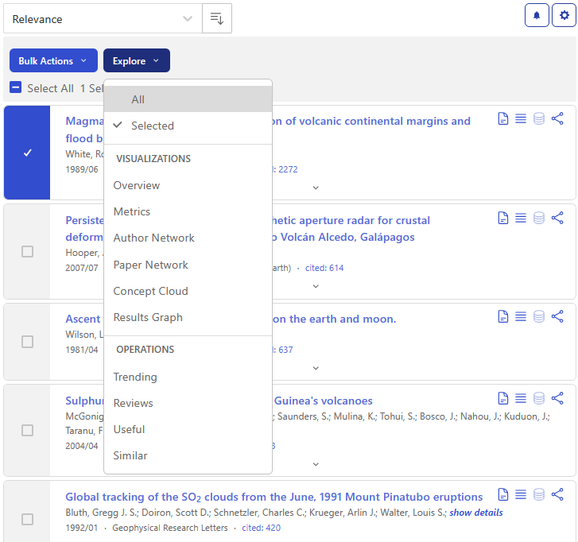{alt="Screenshot of the Explore menu from SciX search results."}

#### Similar

First, let's look at the ```Similar()``` operator.

Results from this second-operator query exclude the results from the original query, so it is best to focus on creating a narrow set of results, or even a single relevant paper, to build off in the ```Similar()``` search, so look through the results and select the one to three papers most relevant for your topic.  I'll select just the first article using the checkbox and click on ```Similar``` under the Explore menu.

It may take a little while for the results from the second-order operator to load.  In the background, Science Explorer is combining the abstracts from articles in the original selection and then ranking all abstracts in SciX based on their textual similarity to the combined abstracts.  The articles returned are the most similar to those from the original selection as determined by text analysis.

{alt="Screenshot of results that are similar to the top result from the original 'volcanoes' search results."}

In addition to lists of papers, ```Similar()``` accepts any text as input.  The format is

```
similar("any text for comparison goes here",input)
```

For instance, I could take text from [U.S. Geological Survey (USGS)](https://www.usgs.gov/) [Volcano Notification Service](https://www.usgs.gov/volcanoes/yellowstone/volcano-updates) report 

{alt="Screenshot of USGS Yellowstone Volcano Observatory Monthly Report dated 2026 September 01"} 

and feed it into ```Similar()```.

```
similar("Yellowstone Caldera activity remains at background levels, with 61 located earthquakes in August (largest = M2.0). Deformation measurements indicate no significant uplift of the north caldera rim since January 2026 and only minor uplift of the caldera since the beginning of the year.",input)
```

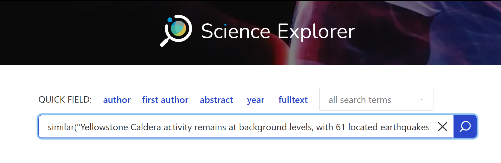{alt="Screenshot of SciX main search bar with 'Similar()'. User has entered text about Yellowstone directly into function."}

to get over 68,000 results.

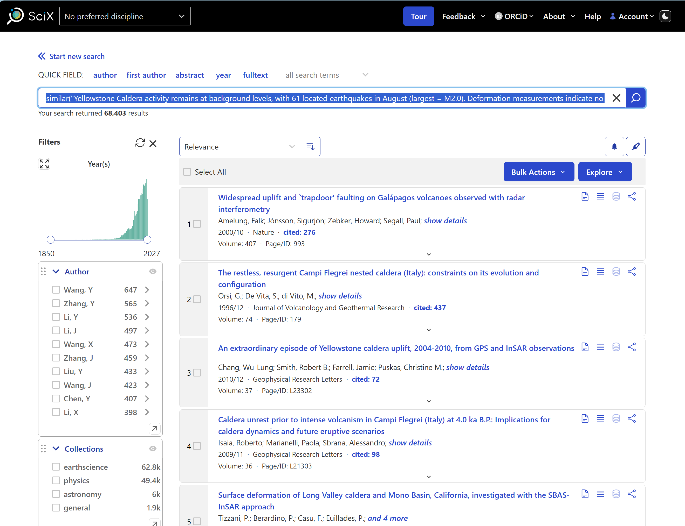{alt="Screenshot of SciX results page from search of 'Similar()' with user-input text about Yellowstone monitoring."}

[Michael Kurtz et al. 2020](https://doi.org/10.3847/25c2cfeb.8d12c399) and the [SciX ```Similar()``` help](https://scixplorer.org/scixhelp/search-scix/second-order) provide examples of sophisticated queries using ```Similar()```

#### Useful

The second-order operator ```Useful()``` examines the references included in papers identified by the original query. It combines them into a list sorted by how often a given paper is referenced in the original set.  The documents returned are the ones cited the most often, by the authors of the chosen papers on the topic, which can include foundational papers, datasets, and software. This query can also expose papers in different, but related fields, such as papers that describe software that other researchers found useful when exploring the topic.

:::: challenge
Submit a query to determine what papers are useful to volcanologists.  

::: solution
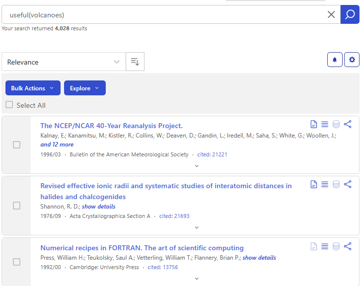{alt="Screenshot of SciX results about volcanoes that are useful."}
Using an unfielded search for volcanoes as input, ```Useful()``` returned over 4,00 results when this example was run as you can see in the upper left; because SciX adds new material on daily and weekly cycles you may see a different count.

The top three papers shown contain significant data sets and fundamental software functions.
:::
:::: 

#### Reviews

The last second-order operator we will cover today is ```Reviews()```. This operator collects the list of papers that cite the papers in the original query and sorts them by how frequently each paper appears. It does not necessarily return articles from review journals, such as _Annual Review of Earth and Planetary Sciences, Annual Review of Astronomy and Astrophysics,_ or _Annual Review of Information Science and Technology_. You can think of the results from a ```Reviews()``` search as a higher-level view of your topic or taking a step back from the details. These results will be the most relevant papers on your topic when viewed from this broader perspective within its field. 

:::: challenge
Submit a query to take a higher-level look at volcanoes, perhaps place it within physical geology more broadly using ```Reviews()```. 

::: solution 
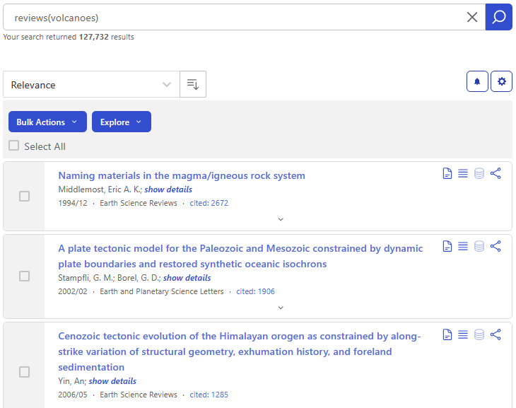{alt="Screenshot of SciX results that are reviews of literature about volcanoes."}
Using an unfielded search for volcanoes as input, ```Reviews()``` returned over 127,00 results when this example was run as you can see in the upper left; because SciX adds new material on daily and weekly cycles you may see a different count.

The top three papers shown appear be about tectonic systems.
:::
::::

If you were looking for a more traditional review journal covering a field with which you were less familiar, you could consult the SciX Journals database. It is available at [https://scixplorer.org/journalsdb](https://scixplorer.org/journalsdb). You can type a word or two into the search bar to identify journals with titles containing those words.

{alt="Screenshot of SciX Journals Database search results for 'Review' "}

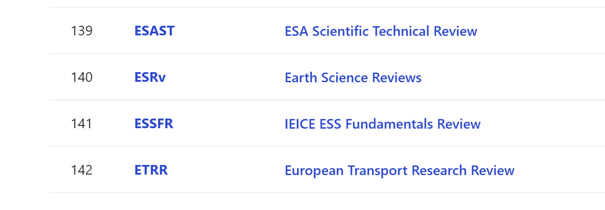{alt="Detail of Screenshot of SciX Journals Database search results for 'Review' near _Earth Science Reviews_'"}

If I try typing "Review", I find a lot of choices. However, scrolling through them, I do not find a volcanology specific review journal. My best option is probably _Earth Science Reviews_ (ESRv). If I click on the abbreviation, I will get all of the papers published in that journal.

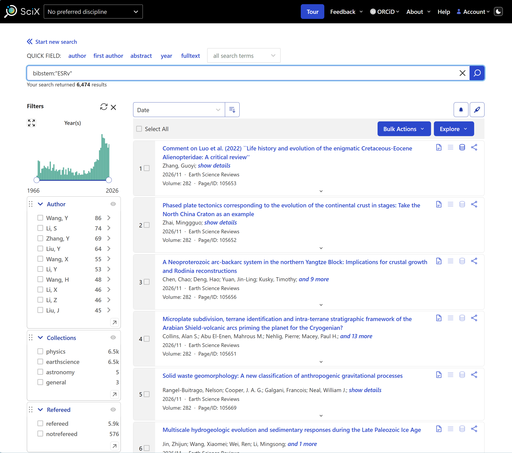{alt="Screenshot of SciX results for all of the papers published by _Earth Science Reviews_ (bibstem = ESRv)"}

Alternatively, if I click on the full name of the journal, I will get more technical information about the SciX holdings for this journal.

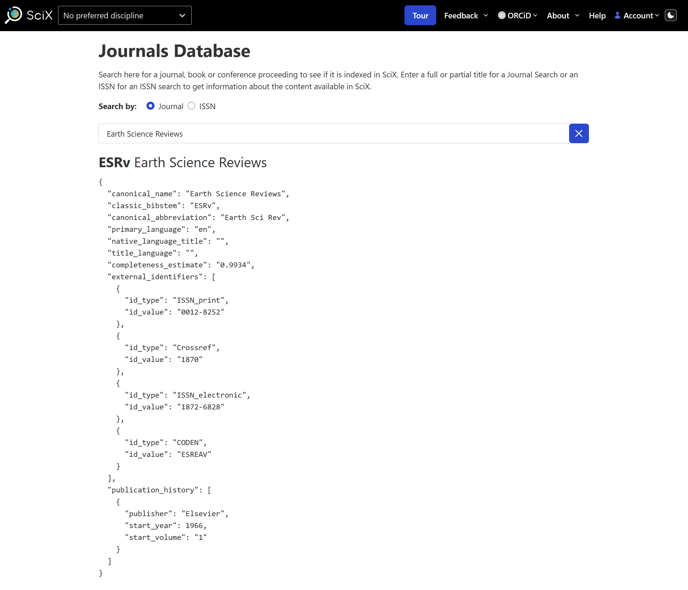{alt="Screenshot of SciX Journals Database listing in JSON for _Earth Science Reviews_"}

::: discussion
### Reflection and Discussion

Spend 2-3 minutes working with second-order operators looking for research trends in a topic of your choice.  Then, discuss what you did and what you learned with a friend. Was something difficult for you? Did something surprise you?

Which operator are you most likely to use:  similar, useful, reviews?
:::

::: instructor
if time permits, ask one or two learners to describe their experience.  If they ran into problems with the operations, be prepared to provide basic support and suggestions.
:::

#### Summary of Second-Order Operators

To review, SciX second-order operators can provide deeper insights and more information about the topic you are researching.  Each of them accept sets of papers, or the results of a previous query, as their input. The graphic below to can help describe the similarities and differences among these operations.

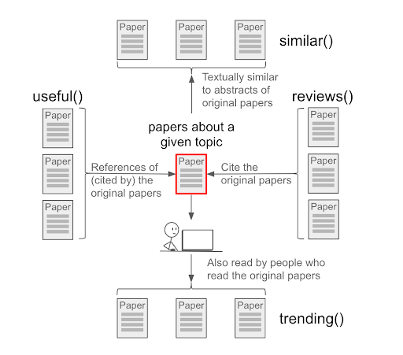{alt="Graphic summarizing the four second order operators of SciX."}

For more information, we recommend 
- [SciX help page on second-order queries](https://scixplorer.org/scixhelp/search-scix/second-order)
- [Second Order Operators in SciX](https://ads.harvard.edu/handouts/SciX_2ndorder_operators.pdf)
- [2020 paper by Michael Kurtz et al on second-order operations](https://doi.org/10.3847/25c2cfeb.8d12c399)

### Connections & Collaborations
Now, let's turn to examining SciX visualizations, and we are going to focus on the paper network and the author network because these two visualizations offer new ways to explore search results.  More traditional graphs of [metrics](https://scixplorer.org/scixhelp/actions-scix/analyze) and [results](https://scixplorer.org/scixhelp/actions-scix/visualize) are also available as is a [concept cloud](https://scixplorer.org/scixhelp/actions-scix/visualize). 

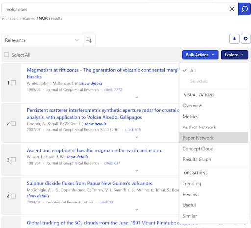{alt="Screenshot of SciX search results on volcanoes with the Explore menu extended and paper network in the visualization section highlighed."}

#### Paper Network

This visualization creates groups of papers by looking at the references from each paper and grouping them based on how many are shared.  Because the papers in these groups cite a similar set of other papers, we can expect the papers in the group to be about the same topics. By default, this visualization only uses data from the first 400 papers in your search results, but you can adjust that; the maximum papers analysized are 1000 papers.  

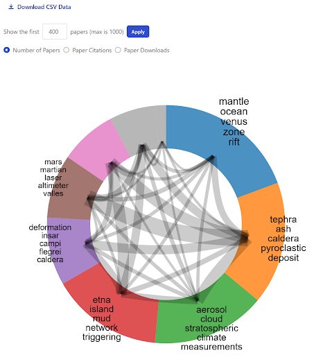{alt="Screenshot of SciX paper network visualization, showing the main subtopic groups for papers in the original volcanoes set."}

Each group is named by extracting shared, unique words from the titles of the set of articles in the group.  These title words can help provide a general overview of the main topics of your original search results.  Clicking on any specific group will display a list of the most cited papers from that group.

You can download a text file in comma-separated-value format (csv) of the data that underlies the graphic.  The cvs file will provide identifiers for each paper and indicate which other papers are in its same group, along with some other metadata such as citation counts and downloads.

Reviewing a paper network can help you drill down into a topic or help you expand your literature search by identifying papers you may have otherwise missed.

#### Author Network

This visualization is created by looking at authors that frequently appear together and creating groups based on the frequencies of those collaborations.  Each of these groups contain authors that often work with each other, though not every author in each group will have worked with every other author in their group.  You may find it helpful when looking for new opportunities, when trying to eliminate possible conflicts of interest, or when surveying the research landscape. 

:::: challenge
Visualize an Author Network

Create a visualization of the Author Network using your search results. Like the Paper Network, this visualization will default to the first 400 papers but you can chance the number used.

::: solution
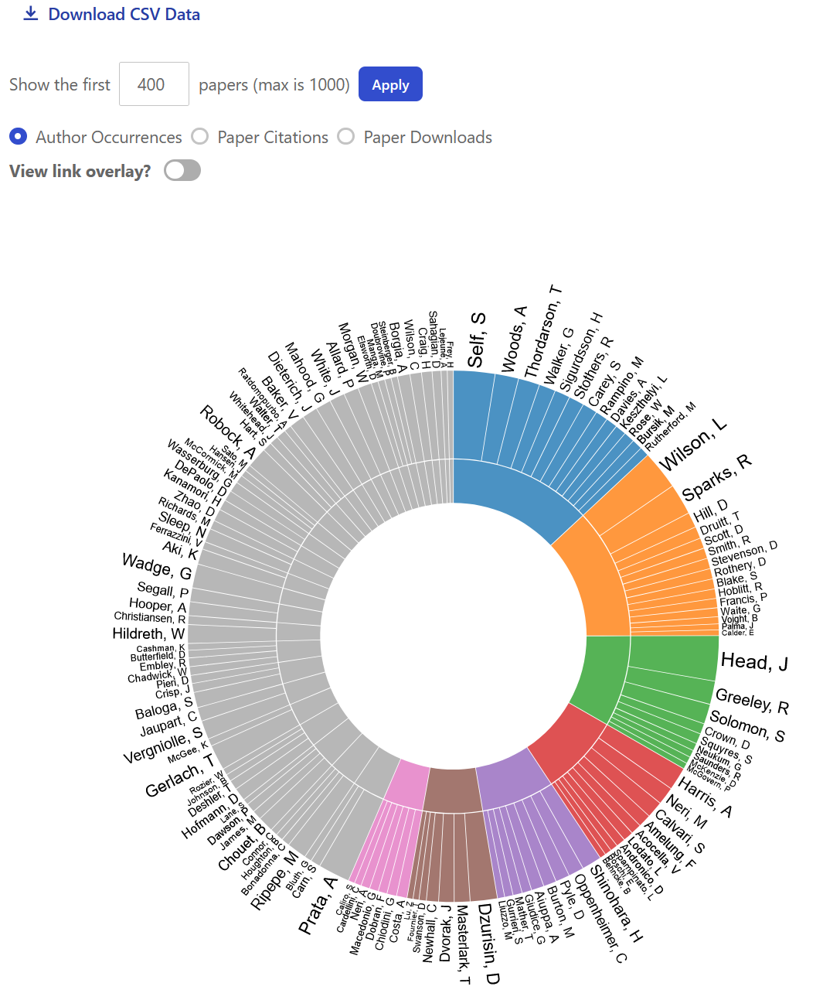{alt="Screenshot of SciX author network visualization, showing the main groups of authors for papers in the original volcanoes results set."}

Using the top 400 documents returned by unfielded search for volcanoes for input, the visualization algorithm identified seven main groups when when this example; because SciX adds new material on daily and weekly cycles you may see a different distribution.
:::
::::

Clicking into the section group, the inside edge of the donut, will bring up the list of papers in that group.  Clicking on a specific name, or their specific section of the donut, will instead show all papers by that particular author.

Clicking on the "View link overlay?" will show connections among individuals in different groups.

Like the Paper Network, the Author Network also has an option to download the underlying data as a csv file.

::: discussion
### Reflection and Discussion

Spend 2-3 minutes individually looking at these visualizations for a topic of your choice.  Then, discuss what you did and what you learned with a friend. Was anything difficult? Did anything surprise you?
How could you use either the paper network or author network in your own work?
:::

::: instructor
if time permits, ask one or two learners to describe their experience.  If they ran into problems with the visualizations, be prepared to provide basic support and suggestions.
:::

### Summary of Visualizations
SciX visualizations provide additional ways of analyzing your search results.  Each takes the results of a query and highlights connections among the documents:  topics through references for the Paper Network, collaborations through authors for the Author Network, influence through citations for metrics and results, and relative frequency of concepts through abstract text for the Concept Cloud. These tools are helpful in building a substantive literature review and in positioning your work to your best advantage.  

For more details about these two graphs and information about the other SciX graphics, we recommend 
- [SciX Help page on Visualizations](https://scixplorer.org/help/actions/visualize)
- [Exploring SciX Visualizations](https://ads.harvard.edu/handouts/SciX_visualizations_handout.pdf) handout 
- [2020 paper by Michael Kurtz et al on second-order operations](https://doi.org/10.3847/25c2cfeb.8d12c399) (Paper Network only)

:::: challenge

## Bonus Challenge
Using search results from a query of interest to you, try one of the Explore menu options that we were not able to cover today. Consult the [SciX Help documentation](https://scixplorer.org/scixhelp/) for anything that is unclear.
::::

::: keypoints

- SciX offers powerful tools that operate on sets of documents to assist you analyzing the literature.   
- ```Similar()``` identifies items that are textually similar:  find more like ....  
- ```Useful()``` analyzes reference lists:  what will help me with ....  
- ```Reviews()``` analyzes citations lists: what has this contributed to ...   
- The Paper Network groups papers topically through their references:  how could I narrow my topic? what am I missing?  
- The Author Network identifies groups through co-authorship:  what collaborations are working in this field? what is that lab producing?  
:::

::: glossary

Author Network - SciX visualization that [groups authors by co-author frequency](https://scixplorer.org/help/actions/visualize); surveys the research landscape for a topic

bibstem -  SciX abbreviation used for journal names and some other publication categories; it can be used as as search field

Concept Cloud -  SciX visualization that [compares frequency or uniqueness of title and abstract words against entire corpus](https://scixplorer.org/help/actions/visualize); can be used to characterize work or to identify search terms

Paper Network  SciX visualization that [groups papers by topic through their references](https://scixplorer.org/help/actions/visualize); can focus help narrow research questions or ensure completeness of literature review

Review colloquial term for an article giving a broad overview of a field and summarizing its current state, some journals focus exclusively on soliciting such contributions

```Reviews()``` - SciX [second-order operator that analyzes citation lists](https://scixplorer.org/scixhelp/search-scix/second-order); takes a higher-level view of a topic by asking what has this contributed to

second-order operator - [query that takes as input the output of a previous query](https://scixplorer.org/scixhelp/search-scix/second-order); in SciX, these frequently operate on sets of documents

```Similar()``` - SciX [second-order operator that analyzes the textual similarity of documents](https://scixplorer.org/scixhelp/search-scix/second-order), returning results that are similar to the input text provided whether from single or multiple papers or directly typed sample

```Useful()``` - SciX [second-order operator that analyzes the reference lists](https://scixplorer.org/scixhelp/search-scix/second-order); takes a nitty-gritty approach to topic by asking what are researchers actually using

visualization - use of graphs and other graphical elements to convey information; can be an effective way of communicating complex relationships, such as [SciX Paper and Author Networks](https://scixplorer.org/scixhelp/actions-scix/visualize)

:::
