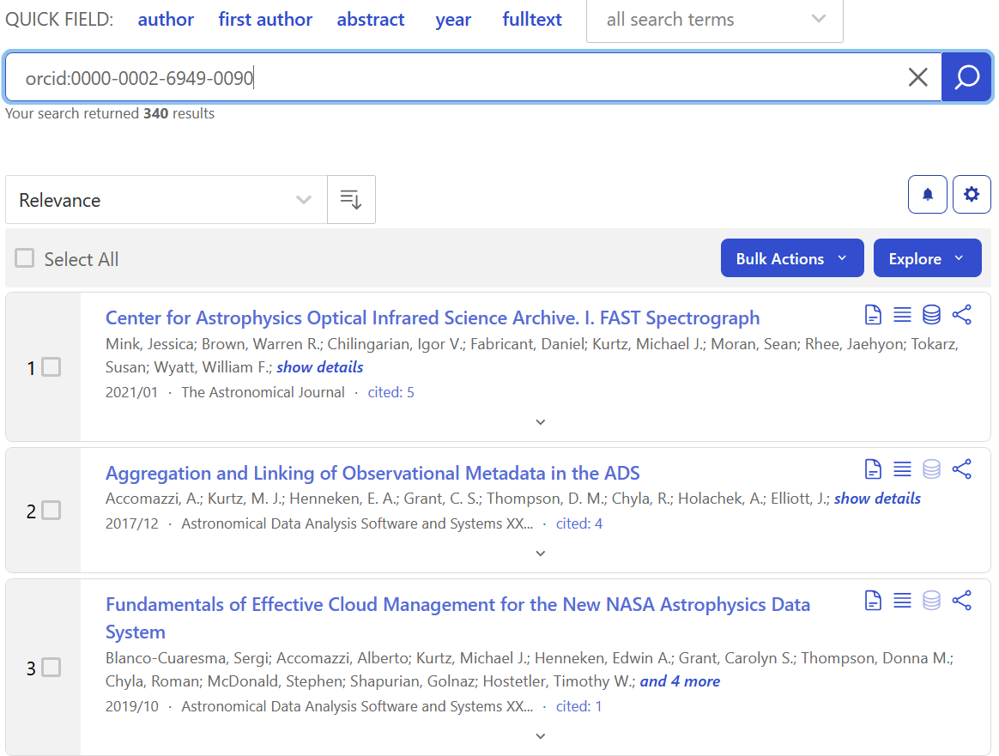
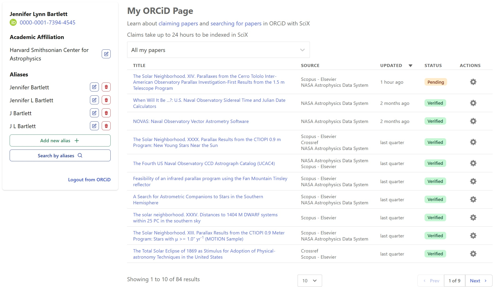
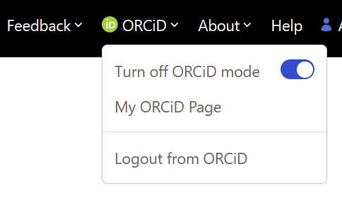
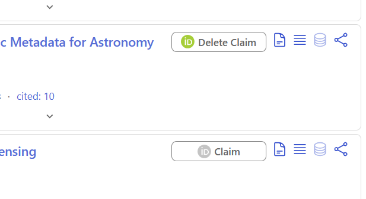

::: questions

- How do I ensure that all my papers are attached to my ORCiD?

:::

::: objectives

- Claim an article using an Open Researcher and Contributor Identification (ORCiD), a unique persistent digital identifier for researchers

:::

## SciX and ORCiD

In this lesson we are going to be talking about how SciX integrates ORCiD. Hopefully, you already have an ORCiD for yourself, and an understanding of ORCiD. If not, please review the Library Carpentries Lesson "Open Research and Contributor IDs (ORCID) for Librarians" before beginning this module.
https://firbolg.github.io/LC_ORCID/

### Setting Up Your Environment

When you navigate to [SciX](https://scixplorer.org/), ensure you can see the homepage.  

{alt="Screenshot of the SciX homepage"}

::: instructor 
Ask learners: "Can everyone see the SciX homepage on their browser?"  
:::

### ADS & SciX

Before we get too far, I want to remind everyone that the Science Explorer is an expanded and updated indexing and abstracting service that is being developed by the same team that created the [Astrophysics Data System](https://ui.adsabs.harvard.edu/).  A lot of SciX's functionality is borrowed from ADS, so you will sometimes see ADS branding even though we are looking at SciX, for the purposes of this lesson you can consider SciX and ADS to be interchangeable.

### ORCiD & SciX

Many researchers and authors today are claiming [ORCiDs](https://orcid.org/) to help disambiguate themselves from others who share their name.  SciX lets you search for published content using an ORCiD, just write "orcid:" before the ID in the query field.  For example:

orcid:0000-0002-6949-0090

{alt="Screenshot of a search for an ORCiD."}

The ORCiD identifiers attached to a paper can come from the publisher, if that information is provided by the authors when submitting the paper.

However SciX also lets you claim papers for your ORCiD, which is especially useful if the papers pre-date the ORCiD system or if you know that the publisher did not collect that information when you originally submitted the paper.  SciX shares these claimed papers back to ORCiD so that they can show up on your profile there.

In order to claim a paper for your ORCiD in SciX, you need to connect to your ORCiD account using the ORCiD menu option at the top of the screen. It will bring up the ORCiD logon screen. Then, you cab sign in with your usual ORCiD credentials. 

::: instructor 
For your information:  Learners transitioning from ADS or who have had some previous SciX experience may have ADS or SciX accounts; the two are interchangeable.  If so, they may have enterend ORCiD information into their ADS or SciX account. They may also have been encouraged to log into both their ADS or SciX account and their ORCiD account. While that procedure is not wrong, it is also not necessary. In the interest of simplicity, the module only demonstrates loging into the ORCiD account, which is sufficient for all ORCiD-related tasks. If a learner asks about ORCiD and SciX accounts, you can find out more about using them together on the SciX "Claiming papers in ORCID" Help page [https://scixplorer.org/scixhelp/orcid-scix/claiming-papers](https://scixplorer.org/scixhelp/orcid-scix/claiming-papers). 
:::

{alt="Screenshot of the ORCiD sign in option in SciX."}

You will first see "My ORCiD Page" listing all of the papers is SciX currently associated with your ORCiD. 

{alt="Screenshot of a 'My ORCiD Page' that shows the status of SciX papers associated with an ORCiD along with information about the user."}

To search for additional papers, click the SciX logo in the upper left of the menu bar to return to the main search page. Once there, click on the ORCiD menu item to verify that ORCiD mode is "On".

{alt="Screenshot of the ORCiD menu in SciX."}

Then, search through SciX for your papers and click the "Claim" button to the right of each article that is yours.  If any are erroneously marked, you can click the "Delete Claim" button to remove your claim on the article.

{alt="Screenshot show the buttons for claim and delete claim in SciX."}

Visiting "My ORCiD Page" will bring back to the dashboard of all of your claimed articles, where you can push them to sync with ORCiD and make other edits.

### Summary

ORCiDs provide a prower tool for uniquely identifying individual authors, many of who may have similar names.  SciX provides tools to search for papers using ORCiDs, where those are known, as well as assistance to authors in ensuring all their papers are properly ORCiD tagged. For more information about ORCiD searches, please visit the SciX "Searching for papers in ORCID" help page [https://scixplorer.org/scixhelp/orcid-scix/orcid-search](https://scixplorer.org/scixhelp/orcid-scix/orcid-search).  For more information about claiming papers with your ORCiD, please visit the SciX "Claiming papers in ORCID" Help page [https://scixplorer.org/scixhelp/orcid-scix/claiming-papers](https://scixplorer.org/scixhelp/orcid-scix/claiming-papers).  You may also find this [ORCiD in SciX](https://ads.harvard.edu/handouts/SciX_ORCiD_handout.pdf) handout helpful.

::: discussion
### Reflection and Discussion

In small groups, review ORCiD mode and SciX's "My ORCiD Page," jot down any questions for the larger group.
If you have publications in SciX, check to see if they are already claimed in ORCiD, and if not, claim them and work with group mates to walk through the process.
Report back any discussion/questions to the class.

How do researchers at your institution use ORiDs? 

:::
