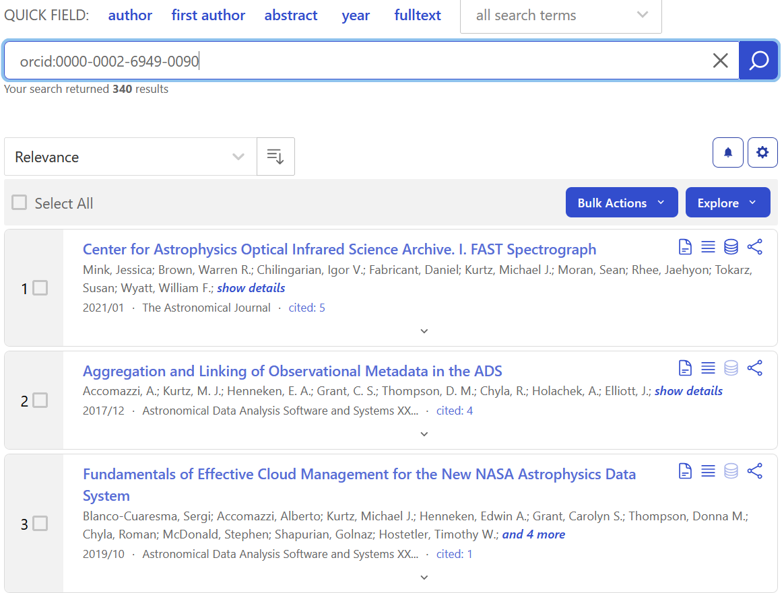
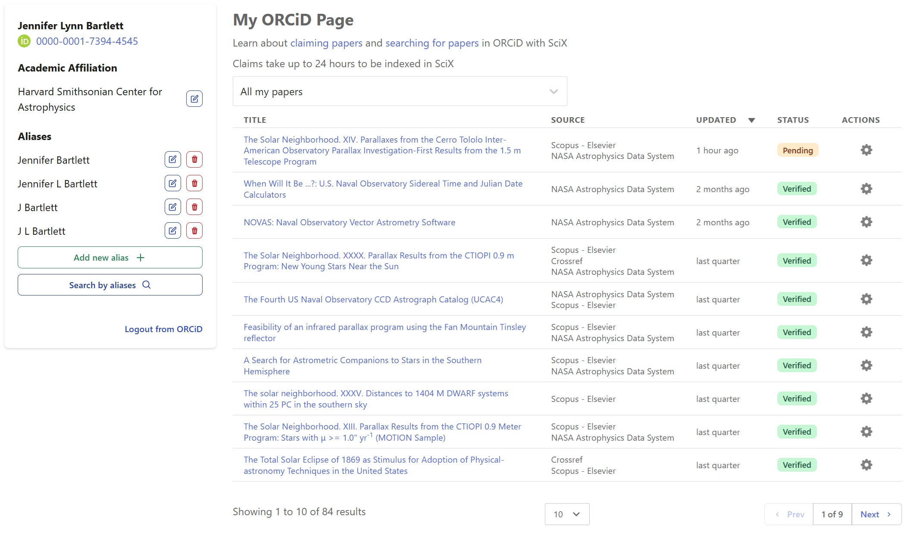
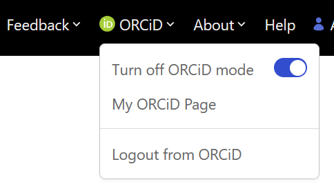
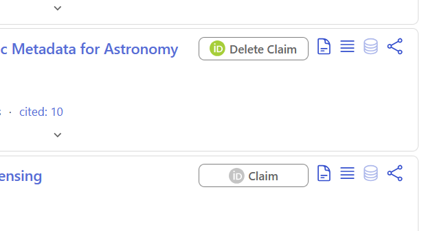

::: questions

- How do I ensure that all my papers are attached to my ORCiD?

:::


::: objectives

- Claim an article using an Open Researcher and Contributor Identification (ORCiD), a unique persistent digital identifier for researchers

:::

## SciX and ORCiD

In this lesson, we are going to be talking about how SciX integrates ORCiD. Hopefully, you already have an ORCiD for yourself, and an understanding of ORCiD. If not, please review the Library Carpentries Lesson "[Open Research and Contributor IDs (ORCID) for Librarians](https://firbolg.github.io/LC_ORCID/)" before beginning this module.

::: instructor
Some learners may have an ISNI (International Standard Name Identifier) rather than an ORCiD. The numbers are formatted similarly; [ORCiDs fall within a reserved range of ISNI](https://info.orcid.org/orcid-and-isni-issue-joint-statement-on-interoperation-april-2013/). However, SciX does not currently support ISNI for research identification and ORCiD provides more robust services to individual researchers. Therefore, learners who have ISNI but not ORCiD should still be encouraged to obtain an ORCiD as well.
::: 

### Setting Up Your Environment

When you navigate to [SciX](https://scixplorer.org/), ensure you can see the homepage.  

{alt="Screenshot of the SciX homepage"}

::: instructor 
Ask learners: "Can everyone see the SciX homepage on their browser?"  
:::

### ORCiD & SciX

ORCiD stands for [Open Researcher and Contributor ID](https://orcid.org/) 
Many researchers and authors today are claiming ORCiDs to help disambiguate themselves from others who share their name.  SciX lets you search for published content using an ORCiD, just write "orcid:" before the ID in the query field.  For example:

```
orcid:0000-0002-6949-0090
```

{alt="Screenshot of a search for an ORCiD."}

The ORCiD identifiers attached to a paper can come from the publisher, if that information is provided by the authors when submitting the paper.

::: discussion **ORCiD Use**

How do researchers at your institution use ORCiDs? What are the expectations of researchers, publishers, funders, and administers regarding these identifiers? What are the barriers to ORCiD use? Discuss with a friend.
:::

::: instructor
If time permits, ask one or two learners to share how ORCiDs are being used at their institution?

If any of them mention barriers to adoption, be prepared to discuss briefly further as class. Would their situation be helped by encouraging additional claims through SciX?
:::

However, SciX also lets you claim papers for your ORCiD, which is especially useful if the papers pre-date the ORCiD system or if you know that the publisher did not collect that information when you originally submitted the paper.  SciX shares these claimed papers back to ORCiD so that they can show up on your profile there.

In order to claim a paper for your ORCiD in SciX, you need to connect to your ORCiD account using the ORCiD menu option at the top of the screen. It will bring up the ORCiD logon screen. Then, you can sign in with your usual ORCiD credentials. 

::: instructor 
For your information:  Learners transitioning from ADS or who have had some previous SciX experience may have ADS or SciX accounts; the two are interchangeable.  If so, they may have enterend ORCiD information into their ADS or SciX account. They may also have been encouraged to log into both their ADS or SciX account and their ORCiD account. While that procedure is not wrong, it is also not necessary. In the interest of simplicity, the module only demonstrates loging into the ORCiD account, which is sufficient for all ORCiD-related tasks. If a learner asks about ORCiD and SciX accounts, you can find out more about using them together on the SciX "Claiming papers in ORCID" Help page [https://scixplorer.org/scixhelp/orcid-scix/claiming-papers](https://scixplorer.org/scixhelp/orcid-scix/claiming-papers). 
:::

{alt="Screenshot of the ORCiD sign in option in SciX."}

You will first see "My ORCiD Page" listing all of the papers in SciX currently associated with your ORCiD. 

{alt="Screenshot of a 'My ORCiD Page' that shows the status of SciX papers associated with an ORCiD along with information about the user."}

To search for additional papers, click the SciX logo in the upper left of the menu bar to return to the main search page. Once there, click on the ORCiD menu item to verify that ORCiD mode is "On".

{alt="Screenshot of the ORCiD menu in SciX."}

Then, search through SciX for your papers and click the "Claim" button to the right of each article that is yours.  If any are erroneously marked, you can click the "Delete Claim" button to remove your claim on the article.

{alt="Screenshot show the buttons for claim and delete claim in SciX."}


Visiting “My ORCiD Page” will bring back to the dashboard of all of your claimed articles, where you can push them to sync with ORCiD and make other edits.

::: Discussion **Reflection and Discussion**
If you have published papers in SciX, spend a few minutes ensuring your ORCiD is associated with each of them.

If you do not have published papers in SciX, do one of the following
- Assist a friend who is working on claiming their papers.
- Search for the papers of someone at your institution and identify which of their papers they should be encouraged to claim soon.

Working with a friend, address any areas of difficulty or confusion.
:::

::: instructor
Ask by show of hands whether learners will be able to assist others at their institutions with claiming papers in the future.
:::

### Summary

ORCiDs provide a prowerful tool for uniquely identifying individual authors, many of whom may have similar names.  SciX provides tools to search for papers using ORCiDs, where those are known, as well as assistance to authors in ensuring all their papers are properly ORCiD tagged.

For more information about using ORCiD in SciX, we recommend  
- [Searching for papers in ORCID](https://scixplorer.org/scixhelp/orcid-scix/orcid-search) SciX help page  
- [Claiming papers in ORCID](https://scixplorer.org/scixhelp/orcid-scix/claiming-papers) SciX Help page  
- [ORCiD in SciX](https://ads.harvard.edu/handouts/SciX_ORCiD_handout.pdf) handout  

::: challenge  **Bonus Challenge**
For a few well-established researchers in your field, compare the effectiveness and efficiency of traditional name searches to ORCiD searches. Which works best now?
:::

::: keypoints   
- SciX encourages authors to identify themselves and claim their work with ORCiDs.    
- Users can search SciX for people using ORCiDs.     
- Users can use SciX search tools to find their papers without ORCiDS and claim them.       
- SciX will communicate users' claims to ORCiD.    
:::

