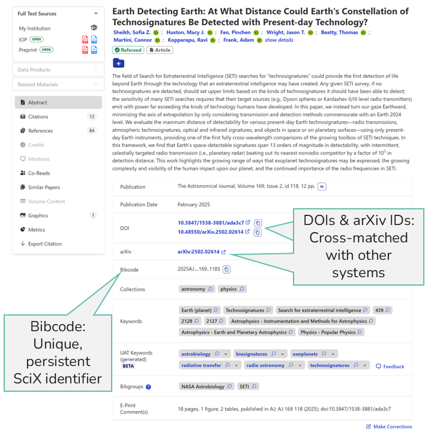
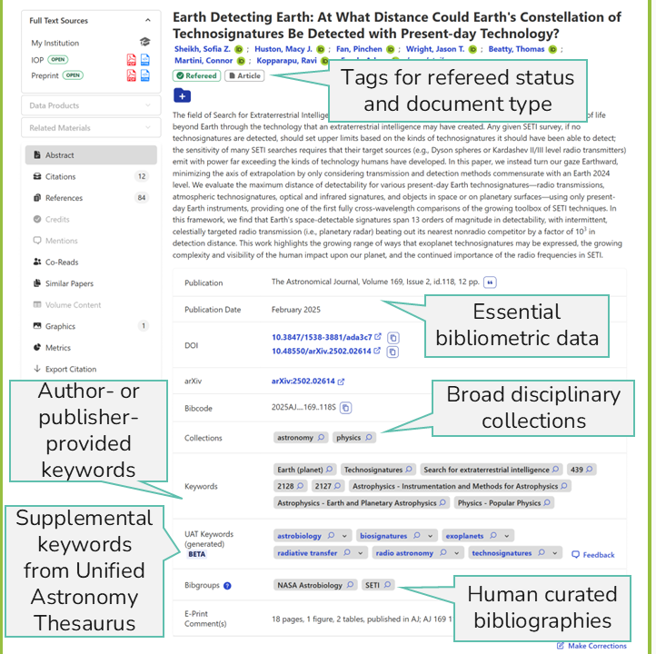
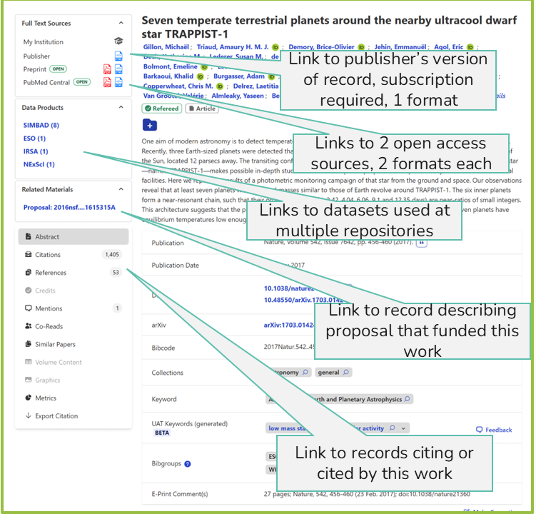
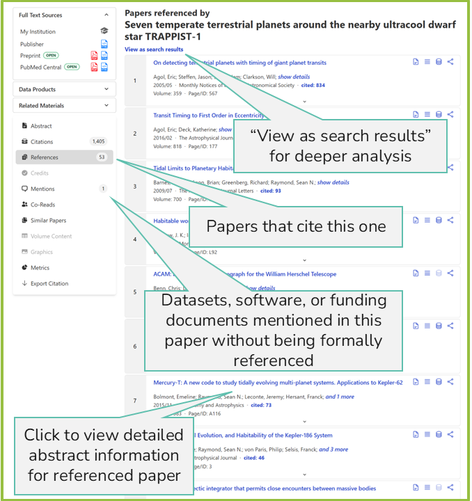

::: questions
- What is Open Science?
- What is FAIR?
- What is do open science and FAIR mean to me? 
:::

::: objectives
- Define the Open Science
- Define FAIR principles and explain what each component (Findable, Accessible, Interoperable, and Reusable) means in the context of scientific data.
- Explain how SciX supports making research artifacts **Findable** and **Accessilbe**
- Identify your role with respect to open science and FAIR practices at your institution
:::

::: instructor
This episode has multiple discussion elements. Pick those that you think will be most meaningful and thought provoking to your audience. Skip the rest.
Also, gauge the tenor of the discussions to balance not disrupting a productive conversation with keeping the class on time. On the other hand, if conversations are stalled, cutting the time short and moving forward is preferrable to letting the group get distracted by other things. 
The prompts are phrased as "discuss with a friend" but in small cohesive groups, you may just want to have a single discussion. In some circumstances, you may want to insist that learners switch partners between questions.
::: 

## Open Science

Open science has become a buzz word today. We are all supposed to be in favor of open science. 

::: discussion 
## Define Open Science

What comes to mind when you hear "open science"? How would you define open science?

Discuss with a friend. Note any areas of disagreement or any difficulties in defining the concept. 
:::

::: instructor
Ask for one or two volunteers to share their definitions of open science or to explain the difficulties they experienced in defining the concept.

You may want to ask learners to read the NASA and UNESCO definitions themselves. They can vote by show of hands for one or the other or for both.
:::

NASA proposes that 

"Open science is a collaborative culture enabled by technology that empowers the open sharing of data, information, and knowledge within the scientific community and the wider public to accelerate scientific research and understanding." -- [NASA Open Science](https://science.nasa.gov/open-science/) 

Furthermore, the [NASA Open Science](https://science.nasa.gov/open-science/) site states:

- "Data, tools, software, documentation, and publications should be available to all (FAIR)"
- "Scientific processes and results should be open such that they are reproducible by members of the community"
- "Processes and participants should welcome participation and collaboration by other researchers and organizations"

 NASA also offers [online training](https://science.nasa.gov/open-science/training/). FAIR here and in this lesson stands for **Findable, Accessible, Interoperable,** and **Reusable.**

UNESCO has a similar definition.

"Open science is a set of principles and practices that aim to make scientific research from all fields accessible to everyone for the benefits of scientists and society as a whole. Open science is about making sure not only that scientific knowledge is accessible but also that the production of that knowledge itself is inclusive, equitable and sustainable."

Furthermore the [introduction to UNESCO's recommendations for open science](https://www.unesco.org/en/open-science/about) states:

"Open science:
- increases scientific collaborations and sharing of information for the benefits of science and society;
- makes multilingual scientific knowledge openly available, accessible and reusable for everyone; and
- opens the processes of scientific knowledge creation, evaluation and communication to societal actors beyond the traditional scientific community."

::: discussion
## Open Science in Real World

Identify an open science practice that does or could benefit your community and the associated benefit(s).

Identify either one unintended consequence of open science practices in your community or one aspect of open science practice that makes members of your community uncomfortable. 

Discuss your experiences with a friend. Brainstorm solutions to the unintended consequences or the areas of reluctance.

:::

::: instructor
Ask for one or two volunteers to share their positive or negative experiences.  If they share a negative experience, ask what solutions they proposed. Then, ask the other learners if they had similar experiences and if they had other solutions to propose. 
:::

The [Science Explorer (SciX)](https://scixplorer.org) is a NASA-funded digital library that is designed to [promote open science practices](https://science.data.nasa.gov/science-explorer) and [support research broadly in the science fields](https://scixplorer.org/home/) in which NASA is interested. 

## FAIR Principles

The NASA definition calls for FAIR "data, tools, software, documentation, and publications." Originally defined in a highly technical manner for data, we now apply FAIR to most research artifacts.

::: discussion
## Define FAIR 

What comes to mind when you hear "FAIR"? How would you identify or measure whether an item was FAIR?

Discuss with a friend. Note any areas of disagreement or any difficulties in defining the concept. 
:::

::: instructor
Ask for one or two volunteers to share their definitions of open science or to explain the difficulties they experienced in defining the concept.

You may want to ask learners to read the NASA and UNESCO definitions themselves. They can vote by show of hands for one or the other or for both.
:::

Again, FAIR stands for **Findable, Accessible, Interoperable,** and **Reusable.** 
 
Scientific credibility is built on transparency, which includes reproducibility. For one group of scientists to reproduce the results of another, those results must be findable and accessible. Of course, findable and accessible does not automatically equal reproducible but they are the first steps.

Traditionally, data supporting scientific research have been difficult to find in many fields. Papers often describe data collection and methods, but rarely included the actual data alongside the manuscript. As articles moved online, publishers were still not typically equipped to store and distribute datasets.

In response, standards were needed to guide data infrastructure. Consequently, participants at a 2014 [Lorentz Center](https://www.lorentzcenter.nl/) workshop developed the FAIR Principles for Scientific Data, which were first published by Wilkenson et al. in 2016 (DOI: [10.1038/sdata.2016.18](https:/doi.org/10.1038/sdata.2016.18) SciX bibcode: [2016NatSD...360018W/abstract](https://scixplorer.org/abs/2016NatSD...360018W/abstract)).  [Each term](https://force11.org/info/the-fair-data-principles/) has been expanded into guiding principles for developing resource platforms like SciX.

::: instructor
Have groups of students take one set of principles. They should review the principles along with the criteria by which SciX claims to be FAIR and consider an additional system with which they are familiar (another search engine, a repository, a vocabulary, a tool kit, a workflow or process.  Do they think these systems are FAIR? Do they think these systems are open? 
If a group does not have an alternative system for comparison, the UAT is considered a FAIR vocabulary. The UAT community handbook describes its practices. 
:::

### Findable Principles

The focus is on making data easy to locate by both humans and computers. This is achieved by creating machine-readable metadata that is essential for automated discovery:

- **F1:** Data and metadata are assigned a globally unique and persistent identifier.
- **F2:** Data are described with rich metadata (as defined further in R1).
- **F3:** Metadata clearly and explicitly include the identifier of the data they describe.
- **F4:** Data and metadata are registered or indexed in a searchable resource.

As fundamentally an indexing service, the [data and metadata SciX](https://scixplorer.org/scixhelp/search-scix/search-syntax) provides are highly searchable. (F4)

{alt='Screenshot of the SciX homepage showing the main search bar and navigation options'}

SciX assigns each item a unique, persistent identifier, a bibcode that not only retrieves the article but also connects related papers via citations. When data, software, or other materials are available, they are either linked as external resources or indexed with their own identifiers internally. For interoperability, SciX also retains and displays the unique identifiers that other systems have assigned the same work. (F1)  

{alt='Screenshot of a SciX abstract page with callouts showing the bibcode and identifiers from other systems.'}

SciX enriches the records it maintains with metadata from multiple sources, including information it develops.  For instance, to make papers more findable, SciX is testing assigning keywords from the [Unified Astronomy Thesaurus (UAT)](https://astrothesaurus.org/) to all papers in its astronomy collection. Doing so provides a consistent set of keywords across time and journals. (F2)

{alt='Screenshot of a SciX abstract page with callouts showing some of the metadata tags.'}

### Accessible Principles

These principles help users understand how to retrieve data:

- **A1:** Data and metadata are retrievable by their identifier using a standardised communications protocol. 
    - **A1.1:** The protocol is open, free, and universally implementable.
    - **A1.2:** The protocol supports authentication and authorisation, where necessary.
- **A2:** Metadata remain accessible even when the data are no longer available.

SciX provides a [free API](https://scixplorer.org/scixhelp/api-scix/) for standardized, programmatic retrieval of records. API users, however, must register for a token. (A1)

Applying accessibly to papers and research artifacts more broadly. SciX always links to the publisher's version of record, even if it has a paywall. It also matches the available open access versions providing the user with multiple options.  In addition, it links to data, software, and proposals to help the user understand how the reported results were achieved, reproduce them or reuse them as appropripiate.

{alt='Screenshot of a SciX abstract page with callouts showing links to full text options and multiple other resources, including datasets and a proposal.'}

### Interoperable Principles

Data often needs to be integrated with other data, used in workflows, or transformed for processing:

- **I1:** Data and metadata use a formal, accessible, shared, and broadly applicable language for knowledge representation.
- **I2:** Data and metadata use vocabularies that follow FAIR principles.
- **I3:** Data and metadata include qualified references to other data and metadata.

SciX uses [the UAT](https://astrothesaurus.org/thesaurus/search-the-uat/) as its preferred vocabulary for describing all research artifacts in the space sciences in part because of its community acceptance and in part because the [UAT is itself a FAIR vocabulary](https://astrothesaurus.org/about/). (I2) 

When an article cites supporting references, the SciX includes the citation information as part of the metadata. SciX maintains cross-references to multiple other systems. (I3)

{alt='Screenshot of a SciX reference list with callouts showing references, citations, and mention.'}

### Reusable Principles

The goal is to ensure data can be reused in various contexts:

- **R1:** Data and metadata are richly described with a variety of accurate and relevant attributes. 
    - **R1.1:** Data and metadata are released with a clear and accessible data usage license.
    - **R1.2:** Data and metadata are associated with detailed provenance.
    - **R1.3:** Data and metadata meet domain-relevant community standards.

SciX follows established publication and community standards and associates metadata with its provenance to ensures that data and other research artifacts are reusable in the appropriate context. (R1)

When SciX is successful in connecting researchers with existing datasets and software that is relevant to their projects, it is encouraging the re-use of scientific assets, which increases the return on investment for funders and increases the citations and recognition of the initial work. 

Although SciX exemplifies all four FAIR principles, its primary focus is on being a discovery platform--making data **Findable.** 

::: instructor
Ask one or two learners to comment on what they thought about the FAIRness of the systems they considered.
:::

We have spent some time defining both open science and FAIR. How do they relate?

::: discussion
## Open Science vs. FAIR

Are open science and FAIR the same? Is FAIR sufficient for open science? Is FAIR necessary for open science?

Discuss with a friend.

:::

::: instructor
Ask one or two learners to share what they concluded about the relationship between Open Science and FAIR.
:::

As part of its open science practice, SciX commits to

- developing [open source code](https://github.com/adsabs/)
- releasing [open source models](https://huggingface.co/adsabs)
- publishing its [work open access](https://scixplorer.org/search?p=1&q=first_author%3A%28%22accomazzi%2C+alberto%22+OR+%22kurtz%2C+michael%22%29+property%3Aopenaccess&sort=score+desc&sort=date+desc&d=heliophysics)

## Reflection and Discussion

- How does SciX make research more discoverable?
- In what ways do open science and FAIR principles benefit your community and society?
- Do you think investing in open science or FAIR best practices if worthwhile for your program?
- What do you see your role in the growing open science ecosystem?

Please share your thoughts with a friend. 

:::: challenge
## Bonus Challenge

If you have not already taken [NASA Open Science Essentials](https://stemgateway.nasa.gov/s/course-offering/a0BSJ0000049icD/open-science-essentials) or [NASA Open Science 101](), browse the [static version](https://doi.org/10.5281/zenodo.15857835) for some additional thought-provoking topics. You could also take the online version,, but it is not always offered.
::::

:::: keypoints

- Open science is a collaborative culture that shares research artifacts and knowledges to accelerate scientific knowledge development.
- The FAIR principles provide a framework for making scientific artifacts, especially data, more discoverable and usable.
- SciX makes data Findable by assigning unique, persistent identifiers and indexing rich metadata.
- SciX ensures Accessibility through standardized retrieval protocols and a robust API.
::::