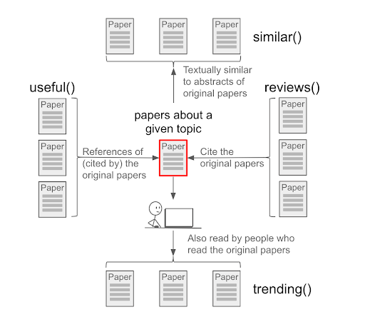
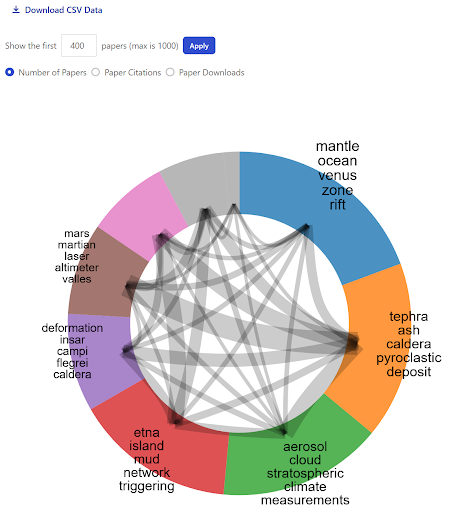

::: questions

- What papers are trending among (example topic) researchers?
- What are the top collaborations in (example topic)?

:::


::: objectives

- Expand a search using SciX second-order operators, including trending, useful, and review
- Explore connections among authors and papers using SciX visualizations

:::

## Literature Exploration in SciX

In this lesson, we will be focusing on different ways to explore your search results in SciX.

### Setting Up Your Environment

When you to to [SciX](https://scixplorer.org/), ensure you can see the homepage.  

{alt="Screenshot of the SciX homepage"}

::: instructor 
Ask learners: "Can everyone see the SciX homepage on their browser?"  
:::

### Research Trends

First we will focus on second order operators, which are search operations that are performed on the results of a previous query.  The second order operators available in SciX are: **similar**, **trending**, **useful**, and **reviews**. Each of these second order operators benefit from taking different things into consideration for the initial query, so we will discuss them all individually in this lesson.

To get started, let's run an example search query on SciX.  You can search for any topic you are interested in, but for my demonstration, I am going to look for papers about volcanoes.

Start by entering your terms into the main search bar and executing the search.

{alt="Screenshot of SciX search results on Volcanoes."}

Next, click on the Explore button menu to see all of the options, which are categorized under two headings: Visualizations and Operations. The options under "operations" are the second order operators.

{alt="Screenshot of the Explore menu from SciX search results."}

#### Similar

First let's look at the "Similar" operator.

Results from this second operator query exclude the results from the original query, so it is best to focus on creating a narrow set of results, or even a single relevant paper, to build off in the "similar" search, so look through the results and select the one to three papers most relevant for your topic.  I'll select just the first article using the checkbox and click on "Similar" under the Explore menu.

It may take a little while for the results from the second order operator to load.  In the background, cience Explorer is combining the abstracts from articles in the original selection and then ranking all abstracts in SciX based on their textual similarity to the combined abstracts.  The articles returned are the most similar to those from the original selection as determined by text analysis.

{alt="Screenshot results that are similar to one of the results from the original Volcanoes search results."}

The SciX documentation about the Similar second order query shows just how powerful this option can be.  For example, this query:

```
similar("weak lensing" -entdate:[NOW-7DAYS TO *]) entdate:[NOW-7DAYS TO *] bibstem:"arXiv"
```

returns a list of arXiv papers made available during the last week that are textually similar to papers published before 7 days ago about "weak lensing". Since the Similar operator excludes results returned by the original query, they used separate date ranges in the first-order query and the outer query in order to force the queries to be different.

#### Trending

The next second-order operator we're going to discuss is called "trending." It returns a list of papers currently popular among people who read the topic of the initial query. The results are sorted by which papers were read the most.  You can select a specific paper, or set of papers, to seed your trend analysis via the Explore menu, or directly query trending for a specific topic in the main search bar.  For example:

```
trending(volcanoes)
```

returns the most popular papers among people who have read the large number of papers about volcanoes.

{alt="Screenshot of SciX results about volcanoes that are trending."}

#### Useful

The second order operator "useful" examines the references included in papers identified by the original query. It combines them into a list sorted by how often a given paper is referenced in the original set.  The documents returned are the ones found most useful, the ones cited the most often, by the authors of relevant papers on the topic.  This can be useful for exposing papers in different, but related fields, such as papers that describe software that other researchers found useful when exploring their topic.

{alt="Screenshot of SciX results about volcanoes that are useful."}

#### Reviews

The last second order operator offered by SciX is “Reviews.” This operator collects the list of papers that cite the papers in the original query and sorts them by how frequently each paper appears. It does not necessarily return articles from review journals, such as _Annual Review of Earth and Planetary Sciences, Annual Review of Astronomy and Astrophysics,_ or _Annual Review of Information Science and Technology_. You can think of the results from a reviews() search as the most relevant papers on the topic originally being researched.

{alt="Screenshot of SciX results that are reviews on literature about volcanoes."}

#### Summary

To review, there are four types of second order operators available in the SciX platform.  These second order operators can provide deeper insights and more information about the topic you are researching.   SciX provides the graphic below to help describe the similarities and differences of these operations.

{alt="Graphic summarizing the four second order operators of SciX."}

For more information, we recommend you visit the SciX help page on second order queries.
https://ui.adsabs.harvard.edu/help/search/second-order
You may also find this [Second Order Operators in SciX](https://ads.harvard.edu/handouts/SciX_2ndorder_operators.pdf) handout helpful.


::: discussion
### Reflection and Discussion

Break into small groups and spend 2-3 minutes individually with second order operators looking for research trends in a topic of your choice.  Then discuss what you did and what you learned with your group.

Which operator are you most likely to use:  similar, trending, useful, reviews?

:::


### Connections & Collaborations
Now, let's turn to examining SciX visualizations, and we are going to focus on the paper network and the author network because these two visualizations offer new ways to explore search results.

{alt="Screenshot of SciX search results on Volcanoes."}

#### Paper Network

This visualization creates groups of papers by looking at the references from each paper and grouping them based on how many are shared.  Since the papers in these groups cite a similar set of other papers, we can expect the papers in the group to be about the same topics.

{alt="Screenshot of SciX paper network visualization, showing the main topic groups for papers in the results set."}

Each group is named by extracting shared, unique words from the titles of the set of articles in the group.  This can help provide a general overview of the main topics of your original search results.  Clicking on any specific group will display a list of the most cited papers from that group.

Reviewing a paper network can help you drill down into a topic or help you expand your literature search by identifying papers you may have otherwise missed.

#### Author Network

This visualization is created by looking at authors that frequently appear together and creating groups based on the frequencies of those collaborations.  Each of these groups contain authors that often work with each other, though not every author in each group will have worked with every other author in their group.  You may find it helpful when looking for new opportunities or when trying to eliminate possible conflicts of interest.

{alt="Screenshot of SciX author network visualization, showing the main groups of authors for papers in the results set."}

Clicking into the section group, the inside edge of the donut, will bring up the list of papers in that group.  Clicking on a specific name, or their specific section of the donut, will instead show all papers by that particular author.

### Summary

By default, both visualizations only use data from the first 400 papers of the search result, but can be expanded up to the first 1000 papers.  Also, both of these visualization graphs have an option to download a text file in comma-separated-value format (csv) of the data that underly the graphic.  The cvs file will provide identifiers for each paper and indicate which other papers are in its same group, along with some other metadata such as citation counts and downloads.

For more details about these two graphs and information about the other graphics provided by SciX, we recommend you review their help page on Visualizations.
https://scixplorer.org/help/actions/visualize
You may also find this [Exploring SciX Visualizations](https://ads.harvard.edu/handouts/SciX_visualizations_handout.pdf) handout helpful.


::: discussion
### Reflection and Discussion

Break into small groups and spend 2-3 minutes individually looking at these visualizations for a topic of your choice.  Then discuss what you did and what you learned with your group.

How could you use either the paper network or author network in your own work?

:::
